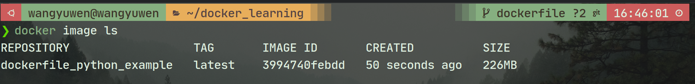

# Dockerfile
我們在前面有提到dockerfile是用於創建docker image的文件檔，裡面包含了一系列的指令  
dockerfile大致上可以分成4個部份:
1. **基礎映像檔** FROM  
   表示我們要搭建的docker image是基於什麼環境為基底而組成的

2. **維護者訊息** MAINTAINER (optional)  
   此docker image是由誰創建維護，包含user名稱以及user email

3. **映像檔操作指令** RUN, ADD, COPY, ...  
   表示當我們在創建映像時，要執行的指令，以讓我們的container在執行時環境是正確可執行的

4. **容器啟動時執行的指令** CMD, ENTRYPOINT  
   搭建完鏡像後，要下的command，以執行我們的應用程式  
   \*Dockerfile中的<font color=#FF0000>***CMD和ENTRYPOINT只能各有一個***</font>

## Dockerfile example
以下是一個簡單的創建dockerfile並執行的案例:
1. 創建一個dockerfile  
   此example以一個簡單例子示範，會安裝numpy並將數列sort以及顯示sorted數列
   ```
   #用官方python作為basic image
   FROM python:3.10.12-slim
   
   MAINTAINER wangyuwen <lspss93121@yahoo.com.tw>
   
   #在docker中創建一個work_dir得資料夾
   WORKDIR /work_dir
   
   #將我們所需的檔案copy至work_dir中
   COPY ./dockerfile/main.py /work_dir/
   
   #根據requirements.txt來進行pip install
   RUN python3 -m pip install --upgrade pip
   RUN pip install --no-cache-dir numpy
   
   CMD ["python3", "main.py"]
   ```

2. 創建完後將docker image搭建起來
   ```
   docker build -t dockerfile_python_example .
   ```
   -t 後面接著的是我們為此docker image所取的名字  
   "\." 名字後面接的是我們要將此docker image放置何處，這裡選擇"\."表示我們要放在當前資料夾中  
   
   我們可以看到我們創建的docker image
   

3. 運行剛剛創建的鏡像並創建container  
   ```
   docker run --rm dockerfile_python_example
   ```
   運行結果如下
   
