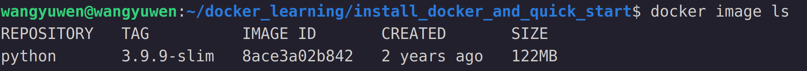
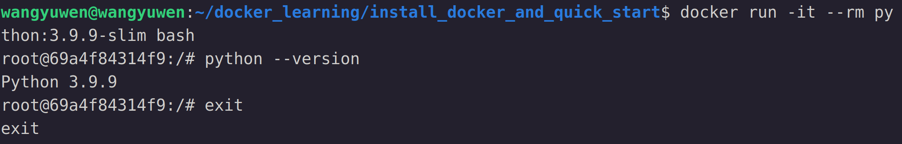

# Install docker
以Ubuntu為例  
1. 更新及安裝相關套件
   ```
   sudo apt update
   sudo apt install apt-transport-https ca-certificates curl software-properties-common
   ```
2. 添加docker的官方GPG密鑰
   ```
   curl -fsSL https://download.docker.com/linux/ubuntu/gpg | sudo gpg --dearmor -o /usr/share/keyrings/docker-archive-keyring.gpg
   ```
3. 設置存儲庫
   ```
   echo "deb [arch=$(dpkg --print-architecture) signed-by=/usr/share/keyrings/docker-archive-keyring.gpg] https://download.docker.com/linux/ubuntu $(lsb_release -cs) stable" | sudo tee /etc/apt/sources.list.d/docker.list > /dev/null
   ```
4. 安裝docker
   ```
   sudo apt install docker-ce
   ```
5. 確認docker是否安裝成功
   ```
   sudo docker --version
   ```
6. 將非root用戶添加到docker群組中使其能夠使用docker
   ```
   sudo usermod -aG docker $USER
   ```

# Docker quick start
1. 先去以下連結註冊docker hub會員  
   [docker hub](https://hub.docker.com/)  

2. 接著在terminal輸入以下指令登入docker hub
   ```
   docker login
   ```

3. 這邊以docker hub的python官網的python:3.9.9-slim為範例  
   [docker hub python官網](https://hub.docker.com/_/python)  
   將docker image pull下來
   ```
   docker pull python:3.9.9-slim
   ```
   可以用以下指令確認是否有被成功pull下來
   ```
   docker image ls
   ```
   

4. run此docker測試
   ```
   docker run -it --rm python:3.9.9-slim bash
   # -it: i表示iteractive使docker可以接收user input, t表示偽終端機供交互操作
   # --rm: 操作完後把此container刪除
   ```
   測試結果如下
   
