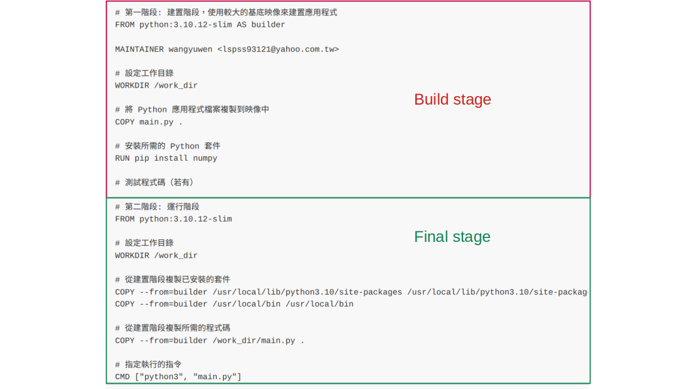

# 多階段dockerfile
Multi-stage build (多階段dockerfile) 是一種優化docker image建構的技術，會在同一個dockerfile中定義多個階段來執行不同的任務，盡可能縮小最終docker image的大小，同時也確保最終的docker image只有執行應用程式的必要資源

多階段dockerfile是在一個dockerfile中，通過使用多個 "FROM" 來實現各個階段的隔離，最終的docker image只會保留最終階段 (最後一個 "FROM")

**多階段dockerfile的優點**
1. 減少最終docker image大小
2. 提高安全性
3. 簡化建構過程
4. 改善性能

由於多階段dockerfile有上述優點，因此多階段dockerfile被廣泛運用於CI/CD當中

## Example
```
# 第一階段: 建置階段，使用較大的基底映像來建置應用程式
FROM python:3.10.12-slim AS builder

MAINTAINER wangyuwen <lspss93121@yahoo.com.tw>

# 設定工作目錄
WORKDIR /work_dir

# 將 Python 應用程式檔案複製到映像中
COPY main.py .

# 安裝所需的 Python 套件
RUN pip install numpy

# 測試程式碼（若有）

# 第二階段: 運行階段
FROM python:3.10.12-slim

# 設定工作目錄
WORKDIR /work_dir

# 從建置階段複製已安裝的套件
COPY --from=builder /usr/local/lib/python3.10/site-packages /usr/local/lib/python3.10/site-packages
COPY --from=builder /usr/local/bin /usr/local/bin

# 從建置階段複製所需的程式碼
COPY --from=builder /work_dir/main.py .

# 指定執行的指令
CMD ["python3", "main.py"]
```

此example分成了兩個stage，分別是build stage和final stage，由於最後在創建image時只會留下final stage的部份，因此可以使在創建環境以及實際應用程式的部份隔離，達到縮小docker image和加強安全性的效果



老實說這個範例code的程式來說完全不需要分成兩個stage，不過只是學習筆記，只是示範可以分成多個stage
