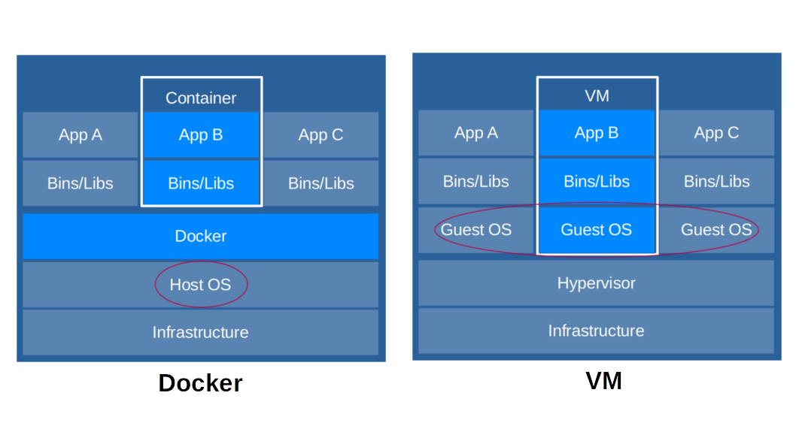

# Docker
Docker是個輕量級的虛擬技術，可以把開發的應用程式及其使用環境一起打包  
打包完給其他人使用就不需要擔心因環境問題而無法執行的問題

## Docker vs VM (Virtual Machine)
Docker經常被拿來跟VM進行比較，因為docker和VM一樣都是虛擬化的技術  
下圖是docker和VM的簡單架構圖

兩者最大的差異為用紅圈框出來的部份

Docker是基於現有的OS，隔離出一個應用程式執行空間，由docker進行容器內的應用程式與OS間的協調

VM則是除了現有的OS外，會再創建出一個新的OS，這個OS可以是任何OS，應用程式則是在這創建出的OS上執行，並由hypervisor使其VM的OS和硬體之間溝通

**Docker和VM都有以下好處:**
1. 環境統一
2. 只須設定一次環境，就可在其他地方應用

**Docker和VM相比有以下好處:**
1. 更有效率利用資源 (VM要創建一整個OS，因此檔案大小以及所需資源遠比docker大)
2. 啟動快速 (理由和第一點相同)

***\*不代表docker就比VM要好，還是要看使用時機***

## Docker基本概念
Docker有四個基本概念:
1. Image (映像檔)  
   Image是創建docker的模板，裡面包含了此docker運行所需要的內容，包含開發者部屬的應用程式、OS、編譯環境等等，image是唯讀的

2. Dockerfile (中文不知道怎麼翻)  
   我們可以去找別人設定好的image來使用，但絕大多數的image無法100%滿足開發者需求，因此開發者通常會自己創建image，創建image需要dockerfile，語法主要由commad和argument組成

3. Container (容器)  
   Container是利用image所創造的實例，可以被啟動、開始、停止、刪除，在同一個image上可以創造多的container，且每個container互不影響

4. Repository (倉庫)  
   和Github非常相似，Github用來存放文件，而docker的repository則是存放image的

流程圖大致如下:

